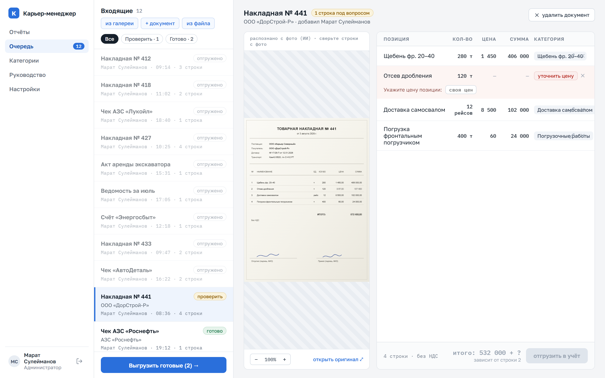
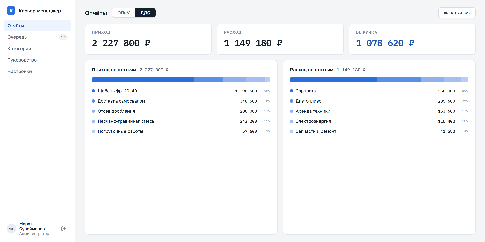
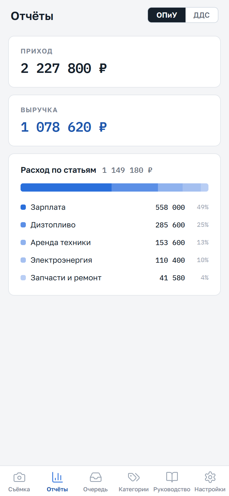

# fin-account · Карьер-менеджер

Приложение для малого карьера: мастер фотографирует первичные документы на телефоне, ИИ распознаёт строки, бухгалтер проверяет спорные позиции в веб-очереди и одной кнопкой отгружает данные в учёт, скачивая выгрузку одним CSV-файлом по колонкам шаблона. Из отгруженных документов строятся отчёты ОПиУ и ДДС.

Доступ разграничен ролями: Наблюдатель (только просмотр), Редактор (просмотр и редактирование), Администратор (плюс управление пользователями). Авторизация с паролями и все данные (документы, категории, шаблоны, пользователи) хранятся в базе на **сервере** — общие для всех и переживают перезагрузку.

Реализовано по дизайн-хэндоффу `design_handoff_karier_manager` (hi-fi экраны).

## Интерфейс

Проверка распознанного документа: слева — снимок, справа — строки, которые вытащил ИИ.
Позиция, в цене которой ИИ не уверен, помечается «уточнить цену» и держит документ на проверке,
пока бухгалтер не подтвердит цену.



Отчёты ОПиУ и ДДС собираются из отгруженных документов, любую статью можно раскрыть до документов,
из которых она сложилась. Выгрузка в учёт — CSV одной кнопкой.



То же приложение на телефоне — мастер снимает документ и видит очередь, руководитель смотрит отчёты:

| Очередь | Отчёты |
| --- | --- |
|  |  |

Данные на скриншотах демонстрационные.

## Стек
- Frontend: React + Vite (`web/`), шрифты Golos Text / IBM Plex Mono, иконки Lucide
- Backend: Node + Express + SQLite (`server/`, встроенный `node:sqlite`) — авторизация и хранение данных; отдаёт и API, и собранный фронт одним процессом
- Утилита: Python + openpyxl (`src/`) — генерация .xlsx-выгрузки (отдельно)

## Структура
- `web/` — веб-интерфейс: вход/регистрация, очередь, отчёты ОПиУ/ДДС, категории, шаблоны, настройки, руководство; адаптив для телефона (< 768px)
- `server/` — API-сервер: авторизация (пароли, роли), база `data.db`, раздача `web/dist`
- `src/` — Python: `export_xlsx.py`, `main.py` (вход из `data/documents.json`)
- `data/`, `output/` — в .gitignore

## Запуск (локально)
Приложение — один процесс: собрать фронт, затем запустить сервер.
```
cd web && npm install && npm run build
cd ../server && npm install && npm start
```
Открыть http://localhost:3001. Первый, кто зарегистрируется, становится администратором;
остальных заводит он в «Настройках». Данные лежат в `server/data.db`.

Для разработки фронта с hot-reload: `cd web && npm run dev` (Vite проксирует `/api` на
бэкенд) — при этом сервер должен быть запущен параллельно (`cd server && npm start`).

Развёртывание на сервер с доступом из интернета — см. [DEPLOY.md](DEPLOY.md).

Выгрузка в .xlsx через Python (вход — `data/documents.json`):
```
py src/main.py
```

## Конфигурация
Скопировать `.env.example` → `.env` и заполнить пути.

## Ветки
- `main` — стабильная версия
- `feat/<название>` — новые функции
- `fix/<название>` — исправления
